<div align="center">


<h1>Energy Landing Zone</h1>

<p><strong>The Institutional-Grade Platform for Standardized Energy Foundations, Industrial Governance Orchestration, and Multi-Cloud Grid Ecosystem Delivery.</strong></p>

[]()
[]()
[]()

<br/>

> **"Industrializing grid delivery to automate energy foundations."** 
> **Energy Landing Zone (Energy-LZ)** is an enterprise-grade platform designed to provide a secure, measurable, and highly automated foundation for global energy operations. It orchestrates the complex lifecycle of energy—from grid edge ingestion and telemetry storage in the lakehouse to analytical transformation and unified grid auditing.

</div>

---

## 🏛️ Executive Summary

Fragmented energy silos and manual grid workflows are strategic operational liabilities; lack of centralized industrial orchestration is a primary barrier to organizational cloud maturity. Organizations fail to maintain a secure energy foundation not because of a lack of grid assets, but because of fragmented industrial standards, lack of automated telemetry validation, and an inability to orchestrate grid planes with operational precision.

This platform provides the **Industrial Intelligence Plane**. It implements a complete **Energy-LZ-as-Code Framework**, enabling Energy and Platform teams to manage global energy foundations as first-class citizens. By automating the identification of ingestion bottlenecks through real-time telemetry analysis and orchestrating the deployment of secure performance-driven energy policies, we ensure that every organizational service—from core grid lakes to distributed energy products—is governed by default, audited for history, and strictly aligned with institutional energy frameworks.

---

## 📐 Architecture Storytelling: Principal Reference Models

### 1. Principal Architecture: Global Energy Landing Zone & Industrial Intelligence Plane
This diagram illustrates the end-to-end flow from grid ingestion and multi-cloud orchestration to telemetry enforcement, quality validation, and institutional grid auditing.

```mermaid
graph LR
    %% Subgraph Definitions
    subgraph GridIngress["Grid Edge & Telemetry Ingress"]
        direction TB
        SmartMeters["Meters / Sensors / IoT Fleets"]
        SCADA_Apps["Grid Control / Refinery / Plant Ops"]
        Renewables["Wind / Solar / Hydro Telemetry"]
    end

    subgraph IntelligenceEngine["Industrial Intelligence Hub"]
        direction TB
        API["FastAPI Energy Gateway"]
        GridOrchestrator["Global Grid & Telemetry Hub"]
        Governance_Hub["Compliance & Contract Guardrail Hub"]
        AIOps_Validator["Drift & Quality Analysis Hub"]
    end

    subgraph OperationsPlane["Distributed Energy Ecosystem"]
        direction TB
        ManagedEnergyLakes["Managed Standardized Energy Lakes"]
        ActivePipelines["Managed Automated Energy Pipelines"]
        GridSinks["Managed Infrastructure Delivery Hubs"]
    end

    subgraph OperationsHub["Institutional Energy Hub"]
        direction TB
        Scorecard["Energy Maturity Scorecard"]
        Analytics["Grid Flow & Readiness Velocity Stats"]
        Audit["Forensic Grid Metadata Lake"]
    end

    subgraph DevOps["Energy-LZ-as-Code Framework"]
        direction TB
        TF["Terraform Energy Modules"]
        DriftBot["Grid & Config Drift Validator"]
        ChatOps["Energy Operations Hub"]
    end

    %% Flow Arrows
    GridIngress -->|1. Submit Telemetry| API
    API -->|2. Orchestrate Ingestion| GridOrchestrator
    GridOrchestrator -->|3. Apply Telemetry Guard| Governance_Hub
    Governance_Hub -->|4. Assess Drift| AIOps_Validator
    
    AIOps_Validator -->|5. Execute Provision| OperationsPlane
    OperationsPlane -->|6. Notify Status| ChatOps
    API -->|7. Visualize Health| Scorecard
    
    Scorecard -->|8. Track Maturity| Analytics
    Scorecard -->|9. Record Provision| Audit
    
    TF -->|10. Provision Backbone| IntelligenceEngine
    DriftBot -->|11. Inject Ingestion Risk| GridOrchestrator
    Audit -->|12. Improve Operations| ManagedEnergyLakes

    %% Styling
    classDef ingress fill:#f5f5f5,stroke:#616161,stroke-width:2px;
    classDef intel fill:#e8eaf6,stroke:#1a237e,stroke-width:2px;
    classDef operations fill:#e1f5fe,stroke:#01579b,stroke-width:2px;
    classDef ops fill:#ede7f6,stroke:#311b92,stroke-width:2px;
    classDef devops fill:#e8f5e9,stroke:#1b5e20,stroke-width:2px;

    class GridIngress ingress;
    class IntelligenceEngine intel;
    class OperationsPlane operations;
    class OperationsHub ops;
    class DevOps devops;
```

### 2. The Energy Data Lifecycle Flow
The continuous path of an infrastructure platform from initial edge (IoT/Grid) and ingest (telemetry) to active store (lakehouse), analyze (predictive), and institutional forensic auditing.

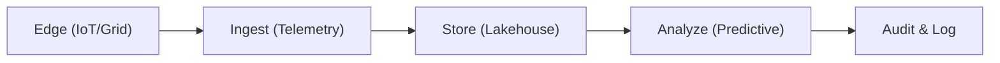

### 3. Distributed Energy Topology
Strategically orchestrating standardized energy landing zones across global grid regions, diverse renewables, and multi-cloud targets, providing a unified institutional view of global energy health and operational readiness.

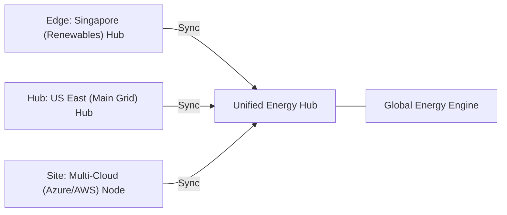

### 4. OT/IT Convergence & High-Trust Data Plane Protection Flow
Executing complex logic for securing the bridge between grid operators and telemetry streams, ensuring every organizational identity is verified and every grid access is according to institutional standards.

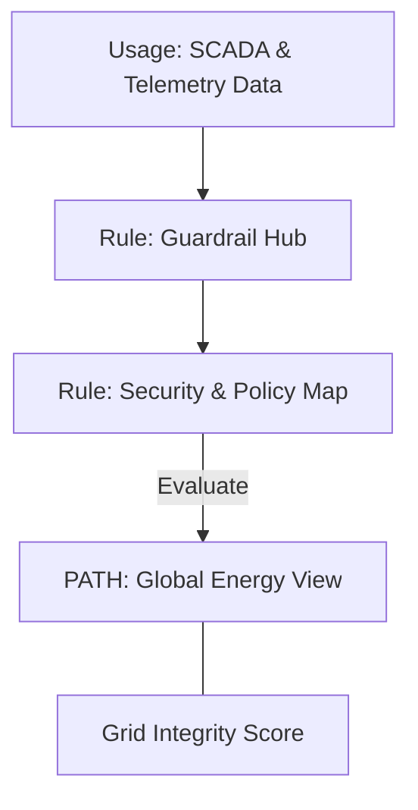

### 5. Multi-Region Grid Federation & Governance Flow
Automatically managing unified energy standards across global regions and diverse utility providers, ensuring institutional data residency and security boundaries by default.

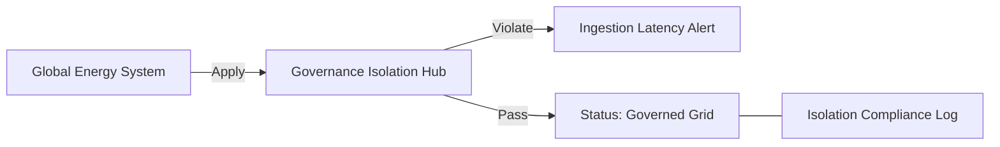

### 6. Encryption & Perimeter Protection Flow (Energy Standard)
Managing the lifecycle of a grid request, automatically enforcing institutional TLS 1.3 and resource encryption standards as required by security policy, ensuring zero-latency security confidence.

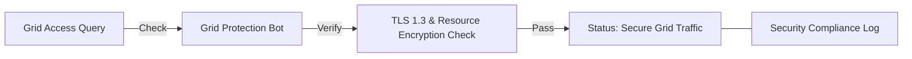

### 7. Institutional Energy Maturity Scorecard
Grading organizational performance based on key indicators: NERC/CIP Compliance Grade, Edge-to-Cloud Security Adoption Index, and Grid Uptime.

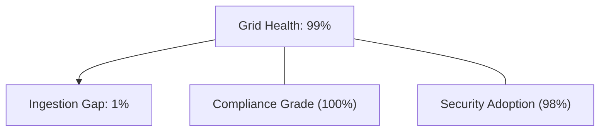

### 8. Identity & RBAC for Grid Governance
Managing fine-grained access to grid hubs, provisioning workers, and audit logs between Grid Operators, Data Scientists, and Compliance Leads.

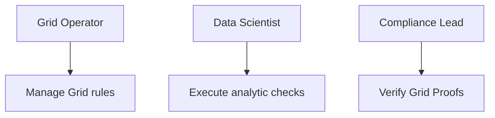

### 9. IaC Deployment: Energy-LZ-as-Code Framework
Using modular Terraform to deploy and manage the versioned distribution of the energy tracking hubs, contract protection workers, and forensic metadata lakes.

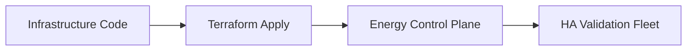

### 10. AIOps Grid Drift & Risk Validation Flow
Using advanced analytics to identify sudden surges in telemetry volume, unauthorized OT changes, suspicious configuration drifts, or unusual grid pattern changes that could result in institutional risk.

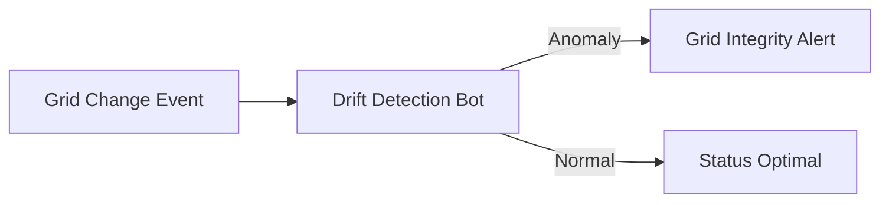

### 11. Metadata Lake for Forensic Grid Audit
Storing long-term records of every grid event generated (metadata), every security event recorded, and every telemetry history for institutional record-keeping, compliance auditing, and post-provisioning forensics.

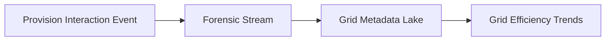

---

## 🏛️ Core Governance Pillars

1.  **Unified Foundation Coordination**: Maximizing resilience by centralizing all energy measurement through a single institutional plane.
2.  **Automated Energy Provisioning**: Eliminating "manual grid silos" through proactive orchestration and pattern verification.
3.  **Sequential Telemetry Intelligence**: Ensuring zero-interruption operations through dependency-aware telemetry-driven grid engineering.
4.  **Zero-Trust Contract Protection**: Automatically enforcing identity-based access and rule evaluation across all energy tiers.
5.  **Autonomous Operations Logic**: Guaranteeing reliability through automated industry-specific grid monitoring runbooks.
6.  **Full Grid Auditability**: Immutable recording of every telemetry change and grid provision for institutional forensics.

---

## 🛠️ Technical Stack & Implementation

### Energy Engine & APIs
*   **Framework**: Python 3.11+ / FastAPI.
*   **Performance Engine**: Custom Python-based logic for multi-cloud grid provisioning and DORA-style readiness metrics.
*   **Integrations**: Native connectors for Azure, AWS, and GCP Grid Service APIs.
*   **Persistence**: PostgreSQL (Energy Ledger) and Redis (Live Contract State).
*   **Auth Orchestrator**: Federated OIDC/SAML for least-privilege grid management access.

### Governance Dashboard (UI)
*   **Framework**: React 18 / Vite.
*   **Theme**: Dark, Slate, Indigo (Modern high-fidelity energy aesthetic).
*   **Visualization**: D3.js for grid topologies and Recharts for readiness velocity analytics.

### Infrastructure & DevOps
*   **Runtime**: AWS EKS or Azure Kubernetes Service (AKS) for management plane.
*   **Grid Hub**: Managed event sourcing for immutable grid security timeline reconstruction.
*   **IaC**: Modular Terraform for deploying the energy landing zone and validation fleet.

---

## 🏗️ IaC Mapping (Module Structure)

| Module | Purpose | Real Services |
| :--- | :--- | :--- |
| **`infrastructure/energy_hub`** | Central management plane | EKS, PostgreSQL, Redis |
| **`infrastructure/enforcers`** | Distributed grid provisioners | Azure, AWS, GCP APIs |
| **`infrastructure/source_pipes`** | Grid Ingestion Hubs | Webhooks, Lambda |
| **`infrastructure/auditing`** | Forensic grid sinks | S3, Athena, Quicksight |

---

## 🚀 Deployment Guide

### Local Principal Environment
```bash
# Clone the landing zone platform
git clone https://github.com/devopstrio/energy-lz.git
cd energy-lz

# Configure environment
cp .env.example .env

# Launch the ELZ stack
make init

# Trigger a mock telemetry update and automated contract validation simulation
make simulate-elz
```

Access the Management Portal at `http://localhost:3000`.

---

## 📜 License
Distributed under the MIT License. See `LICENSE` for more information.

---
<div align="center">
  <p>© 2026 Devopstrio. All rights reserved.</p>
</div>
