<div align="center">


<h1>Energy Landing Zone</h1>

<p><strong>The Enterprise Standard for Digital Energy Foundations and OT/IT Convergence</strong></p>

[]()
[]()
[]()
[]()

<br/>

> **"Powering the transition to a digital, sustainable energy future."** 
> Energy Landing Zone is a flagship repository designed to enable utilities, oil & gas, and renewables providers to design, deploy, and govern cloud environments at industrial scale through secure guardrails and OT-centric blueprints.

</div>

---

## 🏛️ Executive Summary

**Energy Landing Zone (ELZ)** is a flagship repository designed for Utility CIOs, Operations Technology (OT) Leaders, and Energy Infrastructure Teams. As the energy sector undergoes a dual transition—towards digital decentralization and sustainable decarbonization—the cloud foundation becomes the critical path for modernizing grids, refineries, and renewable plants.

This platform provides an industrialized approach to **Digital Energy Foundations**, delivering production-ready **OT/IT Convergence Architectures**, **SCADA Telemetry Ingestion**, **Energy Trading Platforms**, and **Sustainability Reporting**. It leverages **Azure**, **AWS**, and **GCP**, with a primary focus on industrial integration for operational efficiency.

---

## 💡 Why Energy Landing Zones Matter

The energy sector faces unique constraints that traditional enterprise landing zones do not address:
- **OT/IT Convergence**: Safely bridging the gap between high-availability industrial control systems and cloud analytics.
- **Critical Infrastructure Security**: Adhering to NERC/CIP, NIST, and regional regulatory standards for grid stability.
- **Edge Data Gravity**: Processing massive telemetry from smart meters and field sensors at the edge before cloud sync.
- **Market Volatility**: Hosting high-performance trading and analytics platforms that require extreme low latency and resilience.

---

## 🚀 Business Outcomes

### 🎯 Strategic Energy Impact
- **Operational Reliability**: Enhancing grid and plant stability through real-time observability and predictive maintenance.
- **Regulatory Compliance**: Automating the collection of evidence for NERC/CIP and sustainability audits.
- **Decarbonization at Scale**: Enabling the rapid integration of renewable assets and DERs (Distributed Energy Resources).
- **FinOps Excellence**: Optimizing cloud spend through granular site-based and project-based billing models.

---

## 🏗️ Technical Stack

| Layer | Technology | Rationale |
|---|---|---|
| **Governance Engine** | Python, Terraform, Bicep | High-performance orchestration of industrial guardrails and site enclaves. |
| **Control Plane** | FastAPI | High-performance API for landing zone provisioning, telemetry management, and compliance. |
| **Frontend** | React 18, Vite | Premium portal for executive dashboards, site operations, and sustainability boards. |
| **IaC Foundation** | Terraform + Bicep | Multi-cloud consistency with deep industrial integration (IoT Edge, SCADA zones). |
| **Database** | PostgreSQL | Centralized repository for asset inventory, policy state, and sustainability metrics. |
| **Observability** | Prometheus / Grafana | Real-time monitoring of site connectivity, telemetry lag, and grid platform uptime. |

---

## 📐 Architecture Storytelling: 75+ Diagrams

### 1. Executive High-Level Architecture
The holistic vision of the digital energy transformation journey.

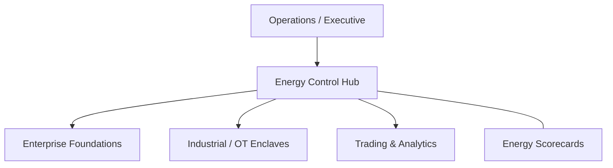

### 2. Detailed Landing Zone Topology
The internal service boundaries and management layers of the energy-centric foundation.

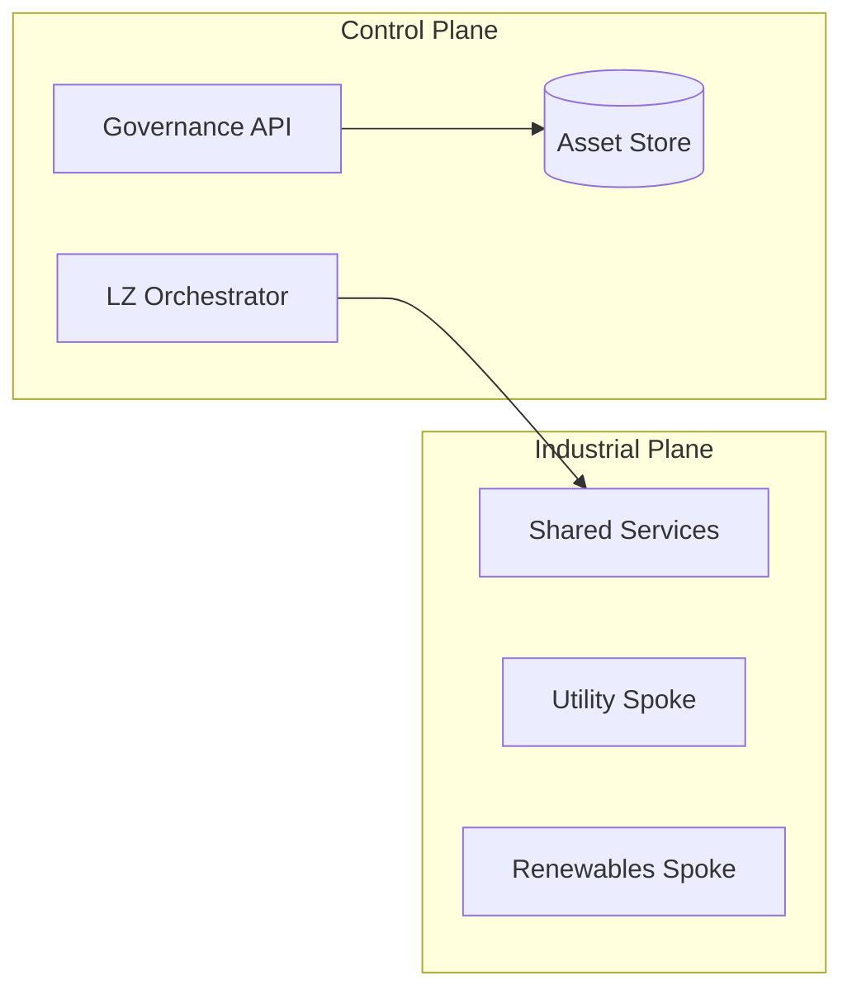

### 3. Site to Cloud Connectivity Path
Tracing telemetry from field industrial control systems to the cloud landing zone.

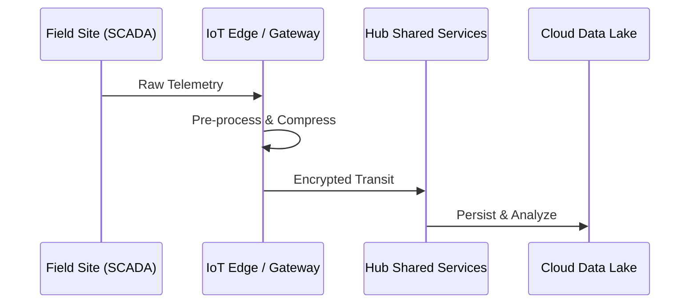

### 4. Control Plane Architecture
The "Brain" of the framework managing global industrial site definitions and policies.

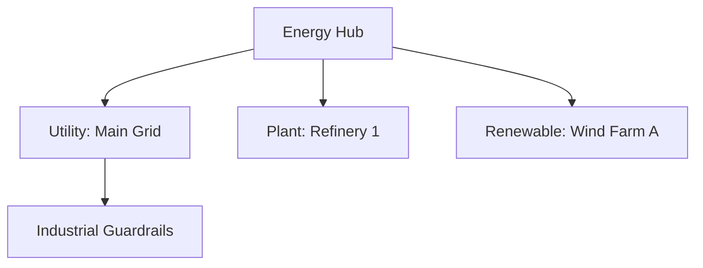

### 5. Multi-Cloud Topology
Synchronizing digital energy standards across Azure, AWS, and GCP.

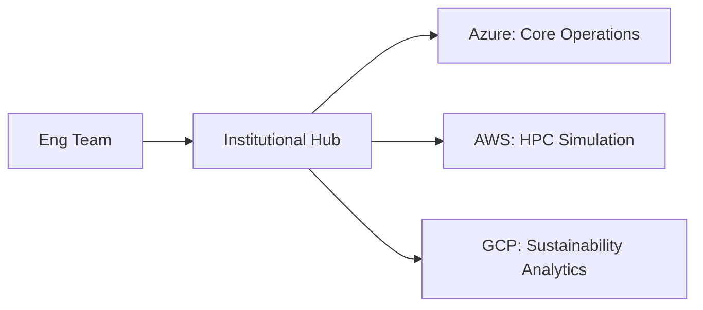

### 6. Regional Deployment Model
Hosting shared services and operational workloads close to the field assets for low latency.

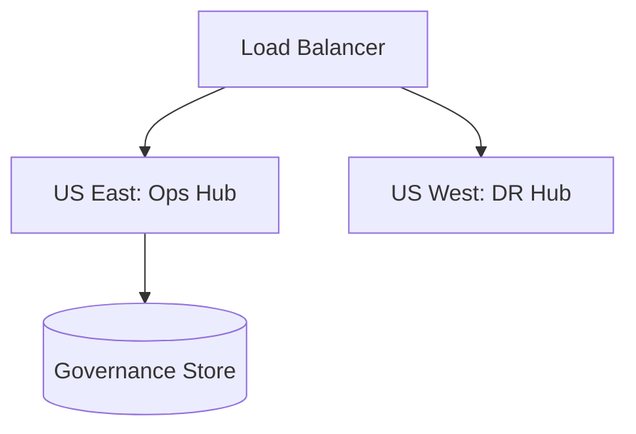

### 7. DR Failover Model
Ensuring platform continuity for critical grid operations and trading systems.

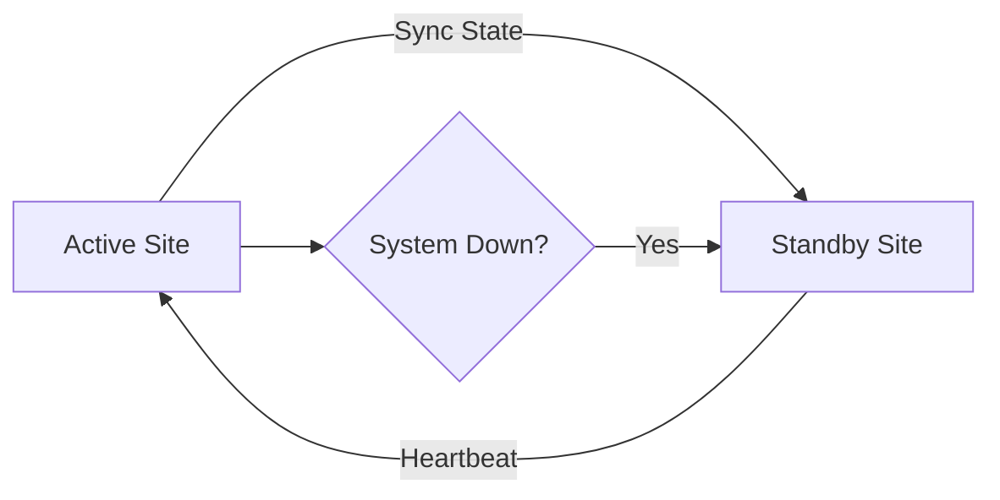

### 8. API Gateway Architecture
Securing and throttling the entry point for industrial orchestration and reporting.

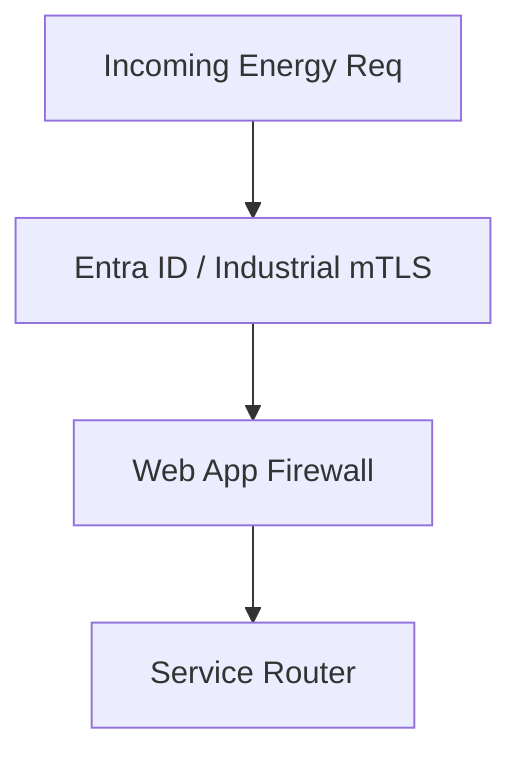

### 9. Queue Worker Architecture
Managing long-running provisioning and massive telemetry processing tasks.

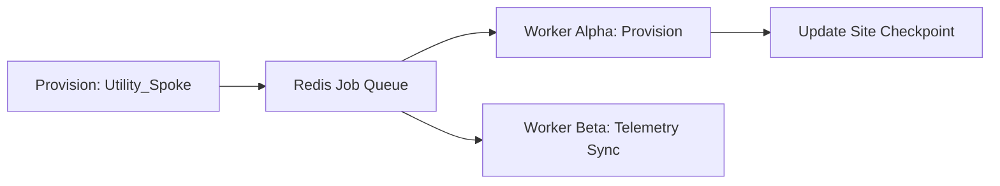

### 10. Dashboard Analytics Flow
How raw industrial telemetry becomes executive energy engineering scorecards.

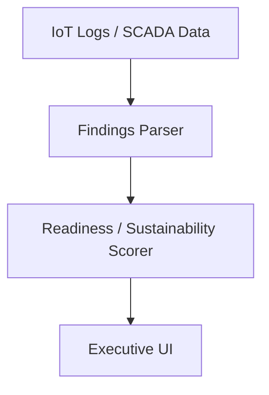

### 11. Management Group Hierarchy
Organizing industrial subscriptions into a logical governance structure.

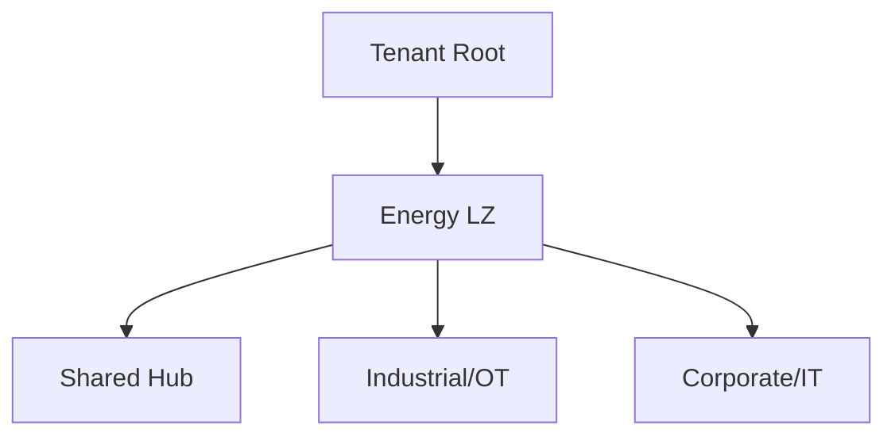

### 12. Subscription/Account Model
Standardizing the delivery of cloud resources through "Energy Subscriptions."

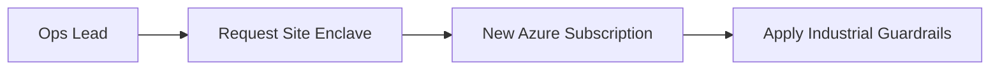

### 13. Business Unit Segmentation
Strictly isolating Utilities, Oil & Gas, and Renewable business units.

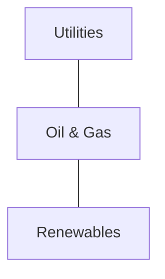

### 14. Shared Services Hub Model
Centralizing core industrial infrastructure (Secure Gateways, DNS, Identity) for efficiency.

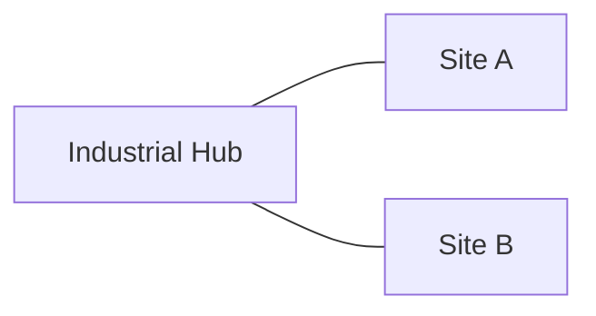

### 15. Hub-Spoke Network Topology
Designing a secure, peered network for cross-site industrial communication.

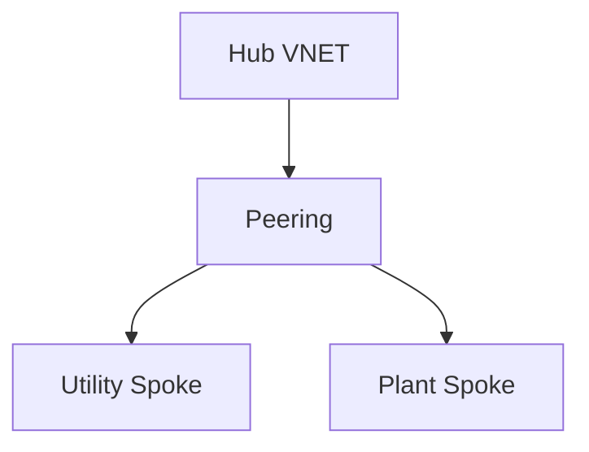

### 16. Transit Connectivity Workflow
Managing traffic between cloud enclaves and on-premise SCADA labs.

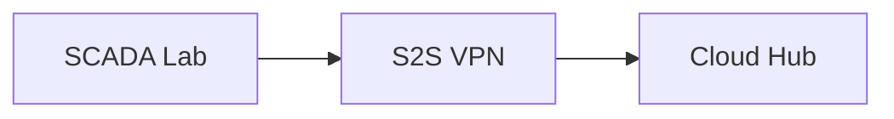

### 17. DNS Architecture
Centralized resolution for industrial assets and cloud services.

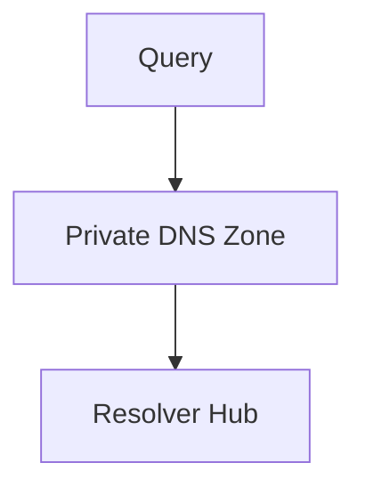

### 18. Identity Trust Boundaries
Defining where industrial machine identity ends and corporate human identity begins.

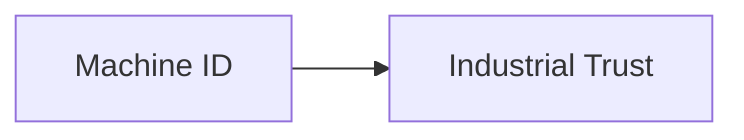

### 19. Environment Separation Model
Strictly isolating Sandbox, Stage, and Production industrial environments.

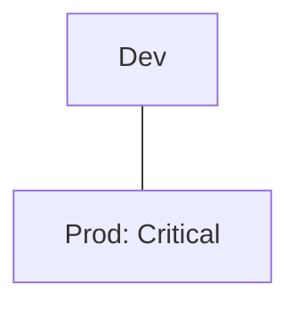

### 20. Sandbox Lifecycle Flow
Automating the creation and automated cleanup of industrial testing sandboxes.

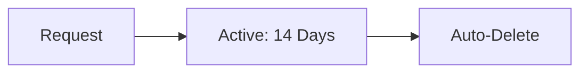

### 21. SCADA Integration Pattern
Securely funneling SCADA telemetry into the cloud analytics plane.

```mermaid
graph TD
    SCADA[SCADA] --> GW[Secure Gateway] --> Cloud[Data Hub]
```

### 22. Smart Meter Ingestion Model
High-throughput ingestion for global smart meter fleets.

```mermaid
graph LR
    Meters[Meter Fleet] --> Ingest[IoT Hub] --> Proc[Stream Proc]
```

### 23. Renewable Wind Farm Telemetry
Real-time monitoring of turbine performance and power output.

```mermaid
graph TD
    Turbine[Turbine] --> Edge[Site Edge] --> Cloud[Wind Dashboard]
```

### 24. Solar Plant Monitoring Architecture
Inverter-level monitoring and power forecast integration.

```mermaid
graph LR
    Inverter[Inverter] --> Coll[Site Collector]
```

### 25. Grid Operations Control Model
Supporting grid management systems with high-availability cloud foundations.

```mermaid
graph TD
    Grid[Grid Controller] --> Cloud[Operational Twin]
```

### 26. Trading platform reference model
Low-latency infrastructure for high-frequency energy trading.

```mermaid
graph LR
    Market[Market Data] --> Trade[Trading Engine]
```

### 27. Refinery Operations Workload Pattern
Digitizing refinery workflows through edge-to-cloud enclaves.

```mermaid
graph TD
    Refinery[Refinery] --> App[Plant Ops App]
```

### 28. Pipeline Monitoring Architecture
Securing long-distance pipeline telemetry via satellite and cellular links.

```mermaid
graph LR
    Sensor[Pipeline Sensor] --> Sat[Satellite] --> Hub[Global Hub]
```

### 29. Mining Operations Connectivity
Ruggedized edge compute for remote, disconnected mining sites.

```mermaid
graph TD
    Mine[Mine Site] --> Rugged[Rugged Edge Kit]
```

### 30. Seasonal Demand Scaling Model
Using auto-scaling to handle peak energy demand events and billing cycles.

```mermaid
graph LR
    Peak[Peak Demand] --> Scale[Scale Out Nodes]
```

### 31. Energy Data Lake Architecture
Centralizing industrial telemetry and market data for deep analysis.

```mermaid
graph TD
    Raw[Raw IoT] --> Bronze[Bronze] --> Silver[Silver] --> Gold[Gold]
```

### 32. Real-time Stream Analytics Model
Processing sub-second telemetry for real-time grid balancing.

```mermaid
graph LR
    Stream[Stream] --> Proc[Flink/Spark] --> Act[Action]
```

### 33. Predictive Maintenance Platform
Using ML models to predict asset failure before it occurs.

```mermaid
graph TD
    Sensor[Vibration] --> Model[Anomaly Detect] --> Alert[Maintenance]
```

### 34. Market Forecasting Workflow
Analyzing weather and consumption data to predict market price movements.

```mermaid
graph LR
    Weather[Weather] --> Forecast[Price Model]
```

### 35. HPC Simulation Cluster Model
Provisioning massive compute for seismic or grid simulations.

```mermaid
graph TD
    Head[Head Node] --> Workers[HPC Compute Fleet]
```

### 36. AI Demand Forecast Platform
End-to-end MLOps for institutional demand forecasting projects.

```mermaid
graph TD
    Train[Train] --> Deploy[Model Registry]
```

### 37. Carbon Reporting Workflow
Automating the collection of Scope 1, 2, and 3 emissions data.

```mermaid
graph LR
    Source[Asset] --> Carbon[Emission Calc]
```

### 38. Cross-Region Data Sharing
Securing data synchronization between global energy hubs.

```mermaid
graph LR
    HubA[US Hub] <-> Sync[Sync Hub] <-> HubB[EU Hub]
```

### 39. Data Sharing Governance
Managing data usage agreements (DUAs) through automated policy enforcement.

```mermaid
graph TD
    Data[Data Set] --> Policy[Access Control]
```

### 40. Digital Twin Architecture
Real-time simulation and optimization of the physical plant in the cloud.

```mermaid
graph LR
    Physical[Plant] <-> Twin[Digital Model]
```

### 41. OIDC / SSO Auth Flow
Standardizing institutional access via Entra ID or Ping.

```mermaid
graph LR
    User[User] --> SSO[Institutional SSO]
```

### 42. RBAC Model
Defining granular roles for Ops Tech, Site Managers, Traders, and Admins.

```mermaid
graph TD
    Role[Ops Tech] --> Perm[View Site Telemetry]
```

### 43. Privileged Access Workflow
Securing high-privilege industrial actions through Just-In-Time (JIT) access.

```mermaid
graph LR
    Admin[Admin] --> JIT[JIT Request] --> Auth[Access Granted]
```

### 44. Secrets Management Flow
Securing industrial API keys and certificates across the estate.

```mermaid
graph TD
    App[Asset] --> KV[Key Vault]
```

### 45. OT Security Zone Model
Implementing ISA/IEC 62443 zone-based security boundaries.

```mermaid
graph LR
    Zone1[OT Control] --- FW[Industrial FW] --- Zone2[IT Ops]
```

### 46. Data Classification Lifecycle
Automatically tagging energy data as Public, Operational, or Restricted.

```mermaid
graph TD
    Scan[Scan] --> Tag[Label: Operational]
```

### 47. Audit Logging Architecture
Centralized tracking of all administrative and industrial access.

```mermaid
graph LR
    Action[Action] --> Hub[Audit Store]
```

### 48. Vulnerability Remediation Flow
Detecting and patching security risks in industrial cloud enclaves.

```mermaid
graph TD
    Detect[Vuln Found] --> Ticket[Auto-Remediate]
```

### 49. SOC Operations Model
The path for detecting and responding to industrial cyber threats.

```mermaid
graph LR
    Soc[SOC] --> Response[Incident Team]
```

### 50. Incident Response Workflow
Standardized steps for handling a cyber-physical incident or outage.

```mermaid
graph TD
    Event[Event] --> Assess[Assess] --> Contain[Contain]
```

### 51. Budget Allocation Workflow
Linking cloud spend to specific plants or project codes.

```mermaid
graph LR
    Plant[Plant ID] --> Spend[Compute Usage]
```

### 52. Chargeback / showback Model
Visualizing cloud consumption for departmental and site accountability.

```mermaid
graph TD
    Report[Usage Report] --> Site[Site Manager]
```

### 53. Plant Cost Center Billing
Managing the unique financial lifecycle of industrial cloud projects.

```mermaid
graph LR
    Site[Site] --> Wallet[Allocated Budget]
```

### 54. Capacity Planning Workflow
Predicting future operational compute needs based on asset growth.

```mermaid
graph TD
    Growth[New Assets] --> Forecast[Capacity Needs]
```

### 55. Patch Management Lifecycle
Keeping industrial OS and platforms secure and up-to-date.

```mermaid
graph LR
    Update[Patch] --> Test[Test Env] --> Rollout[Fleet Wide]
```

### 56. Metrics Pipeline
Monitoring the performance of industrial platforms and landing zone health.

```mermaid
graph TD
    Hub[Hub] --> Prom[Prometheus]
```

### 57. Logging Architecture
The unified path for telemetry from field apps to central operations.

```mermaid
graph LR
    App[Field App] --> Log[Forwarder] --> Hub[Loki/Elastic]
```

### 58. Tracing Model
Observing distributed requests across complex industrial service meshes.

```mermaid
graph TD
    SCADA[SCADA] --> API[Data API] --> DB[Database]
```

### 59. Release Pipeline Governance
Governing software releases for critical grid and plant systems.

```mermaid
graph LR
    Code[Code] --> Gate[Security Check] --> Deploy[Live]
```

### 60. Change Management Workflow
Standardizing changes to core industrial infrastructure.

```mermaid
graph TD
    Req[Change Req] --> CAB[Review Board] --> Execute[Approve]
```

### 61. Executive KPI Review Cycle
The quarterly review of operational readiness and sustainability for the board.

```mermaid
graph LR
    Stats[Stats] --> Deck[Executive Summary]
```

### 62. Reliability Scorecard Model
Measuring platform uptime and telemetry lag for critical sites.

```mermaid
graph TD
    Score[Reliability: 99.99%]
```

### 63. Sustainability Dashboard Flow
Monitoring the carbon footprint and energy efficiency of industrial IT.

```mermaid
graph TD
    Pwr[KWh] --> Carbon[CO2 Saved]
```

### 64. Site Benchmark Comparison
Comparing the operational maturity of different plants or renewable sites.

```mermaid
graph LR
    PlantA[Plant A: 94%] vs PlantB[Plant B: 82%]
```

### 65. Safety Reporting Workflow
Integrating industrial safety incidents into the digital oversight portal.

```mermaid
graph LR
    Inc[Incident] --> Report[Safety Dashboard]
```

### 66. Regulatory Evidence Workflow
Generating documentation for NERC/CIP or regional regulatory audits.

```mermaid
graph LR
    Data[System Data] --> Report[Compliance Proof]
```

### 67. Quarterly Planning Cadence
Aligning cloud strategy with the industrial turnaround and maintenance cycles.

```mermaid
graph TD
    Q1[Build] --> Q2[Maintenance Cycle]
```

### 68. Board Reporting Model
The high-level summary of industrial cloud risk and value for the board.

```mermaid
graph LR
    Board[Board] <-> CIO[CIO Strategy]
```

### 69. Energy Maturity Roadmap
The journey from "Manual OT" to "Industrialized Digital Operations."

```mermaid
graph LR
    S1[Connected] --> S4[Autonomous Operations]
```

### 70. Continuous Improvement Loop
The ultimate feedback cycle for industrial excellence.

```mermaid
graph LR
    Test[Test] --> Learn[Learn] --> Evolve[Evolve]
    Evolve --> Test
```

### 71. Multi-country Operator Model
Governing global industrial assets under a single landing zone.

```mermaid
graph TD
    HQ[HQ] --> SiteA[US Site] --> SiteB[EU Site]
```

### 72. EV Charging Platform Integration
Orchestrating digital foundations for large-scale EV charging networks.

```mermaid
graph LR
    Charger[Charger] --> App[Charging API]
```

### 73. Hydrogen Plant Digital Model
Delivering digital enclaves for emerging green hydrogen infrastructure.

```mermaid
graph TD
    H2[H2 Plant] --> Twin[Digital Twin]
```

### 74. Smart Grid Future State
Visionary architecture for fully autonomous, self-healing digital grids.

```mermaid
graph LR
    Grid[Smart Grid] <-> AI[Autonomous Control]
```

### 75. Innovation Portfolio Roadmap
Planning the next 36 months of industrial cloud evolution.

```mermaid
graph TD
    Now[Now] --> Year3[Autonomous Grid]
```

---

## 🔬 Industrial Cloud Methodology

### 1. The Energy Pillars
Our platform is built on four core pillars:
- **Resilience**: Designing for high availability in critical cyber-physical environments.
- **OT/IT Convergence**: Safely bridging the gap between industrial control and cloud scale.
- **Sustainability**: Embedding carbon tracking and green energy reporting into the foundation.
- **Trust**: Ensuring every asset and machine identity is cryptographically verified.

### 2. NERC/CIP & Security Zoning
We provide automated "Industrial Guardrails" that enforce ISA/IEC 62443 zone-based segmentation and NERC/CIP compliance across every landing zone deployment.

---

## 🚦 Getting Started

### 1. Prerequisites
- **Terraform** (v1.5+).
- **Bicep** (latest).
- **Azure Subscription** (Enterprise Agreement recommended).

### 2. Local Setup
```bash
# Clone the repository
git clone https://github.com/Devopstrio/energy-lz.git
cd energy-lz

# Start the Energy Governance Control Plane
docker-compose up --build
```
Access the Dashboard at `http://localhost:3000`.

---

## 🛡️ Governance & Security
- **Secure by Default**: Industrial-grade mTLS, secure boot, and zero-trust boundaries are foundational.
- **Policy as Code**: Every enclave deployment is validated against the Energy Security Policy.
- **FinOps**: Built-in site-based billing and operational budget tracking.

---
<sub>&copy; 2026 Devopstrio &mdash; Engineering the Future of Industrialized Digital Energy.</sub>
